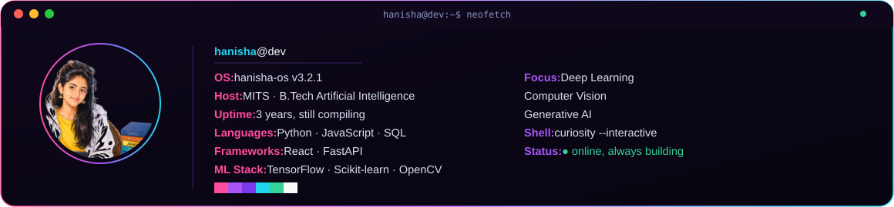
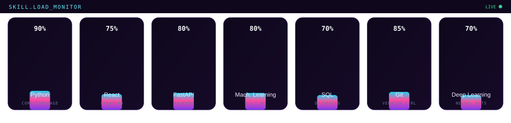
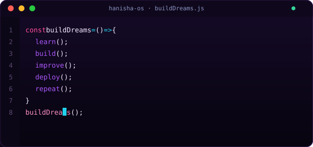

<picture>
  <source media="(prefers-color-scheme: light)" srcset="banner-light.svg">
  <source media="(prefers-color-scheme: dark)" srcset="banner.svg">
  
</picture>

<code>hanisha@dev:~$</code> <i>a system built from curiosity, coffee, and clean commits.</i>

 

 

## 🖥️ boot.sequence — about me

 

## 📦 modules.installed — tech stack

  

 

## 📊 skill.load_monitor

 

## 💻 process.active — what's compiling right now

 

## 🚀 deployed.projects

 

## 📈 runtime.metrics — github stats

  

Live data from <a href="https://github.com/stats-organization/github-stats-extended">github-stats-extended</a> and <a href="https://github.com/DenverCoder1/github-readme-streak-stats">github-readme-streak-stats</a> — pulled fresh from the GitHub API on every view. If a card ever shows broken, it means that free service is temporarily overloaded — reload later, it is not a broken link.

 
 

## 🪪 access.card

 

## 📆 activity.log

Generated daily by <a href=".github/workflows/github-snake.yml"><code>.github/workflows/github-snake.yml</code></a>, publishing to an <code>output</code> branch — commit history eating itself, on schedule. ✨

 
 

## 💭 core.philosophy

*"hanisha-os doesn't ship features. it ships understanding — one commit, one model, one clean line at a time."*

Every project here exists to answer a real question I had, not to pad a résumé.

 

## 📡 connect.endpoints

  

 

